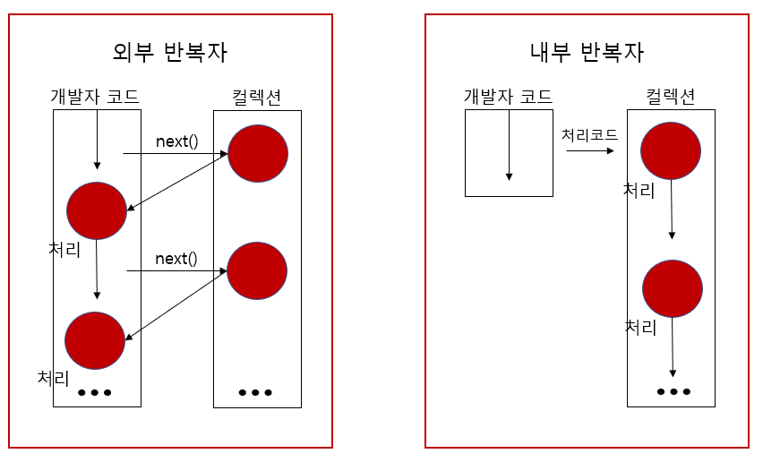
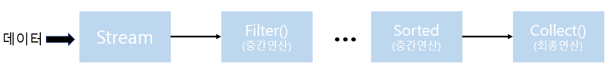
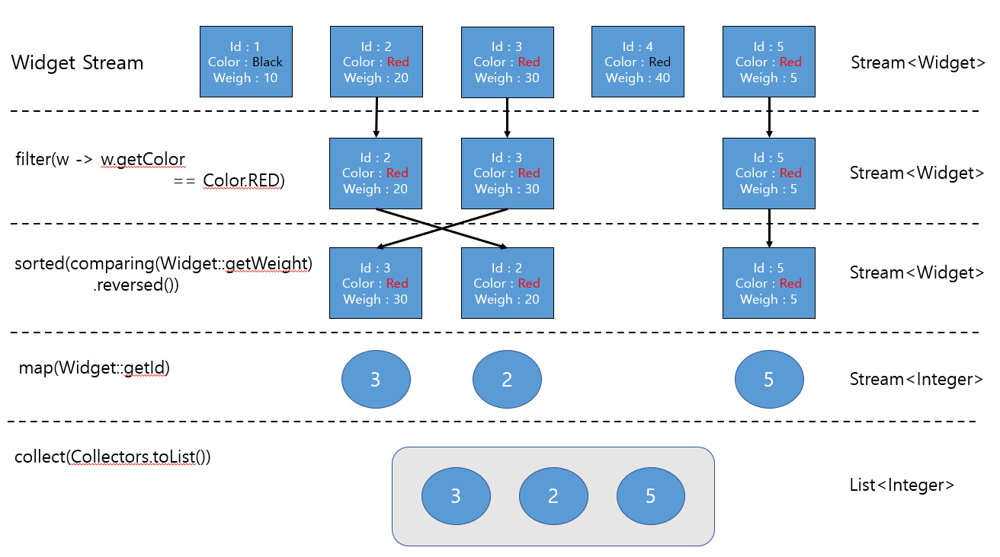

# Stream 이란

## 1. Java Stream
1. Stream 함수란?
   - 간단히 '소스의 요소 시퀀스를 통해 집계 작업을 처리'로 정의할 수 있습니다.
     - 집계 작업 : SQL과 같은 집계 함수(평균, 최소, 최대 값)의 기능을 지원합니다 (find, reduce, match, sorted 등)
     - 소스 : 스트림은 Collection, Array 등 일련의 같은 데이터 집합
     - 요소 시퀀스 : 각 데이터 집합의 데이터 조각들, 스트림은 요소를 계산할 뿐 저장하지 않으며 특정 유형의 요소 시퀀스 값에 인터페이스를 제공합니다.
   - 다양한 데이터 소스(집합)를 표준화된 방법으로 다루기 위한 라이브러리이다. 즉 컬렉션, 배열 처럼 일련의 데이터 집합에서 표준화 된 집합 함수를 사용하여 처리할 수 있다라고 보면 될 것 같습니다.
2. Stream 특징
   1. Stream은 저장공간이 없다. 
      - 스트림(배열, 컬렉션 등)은 요소를 읽어들여 처리할 뿐 데이터 소스를 변경하지 않으며 파이프 라인(계산작업)을 통해 처리된 요소들을 전달하고 결과를 처리합니다. 
      - 또한 집계 작업에서도 원본데이터에서 데이터를 제거하는게 아니라 필터링을 걸친 데이터를 새로운 항목으로 생성합니다. 
      - Collection에서 복사는 얕은 복사임으로 원본 데이터 변경하는 부분을 추가하게 되면 결과가 다르게 나오거나 이후 데이터 사용에 있어 문제가 됨으로 원본 데이터의 수정은 깊은 복사를 구현하여 복사된 데이터를 통해서 처리해야합니다. 즉 immutable의 속성을 지녀야 합니다.
   2. 스트림은 일회용
      - 스트림은 한번 사용하게 되면 닫혀서 다시 사용할수 없으므로 필요하다면 스트림을 다시 생성해야 합니다.
   3. 내부 반복
      - 외부 반복은 개발자가 직접 코드에서 컬렉션의 요소를 반복해서 가져오는 패턴입니다.
      ~~~ java
         List<String> list = new ArrayList<>();

         // 컬렉션의 경우
         for(int i=0; i<list.size(); i++) {
            String element = list.get(i);
            // 처리 코드
         }

         // Iterator의 경우
         Iterator<String> iter = list.iterator();
         while(iter.hasNext()) {
            String element = iter.next();
            //처리 코드
         }
      ~~~
      - 내부 반복자는 API에게 반복에 대한 구현을 맡기고 처리코드에 대한 부분만 제공하는 패턴이다. Stream에서는 람다식부분이 처리코드이며 이외 반복하는 구현체는 Java api에서 구현되어 있습니다.(약간 반복하는 부분을 의존한다고도 볼수 있다)
      - 내부 반복자의 이점은 컬렉션 즉, Java api가 반복을 구현하기 때문에 병렬처리 같은 경우에도 지원되기 때문에 처리 코드만 작성하면 됩니다. 
      ~~~ java
         // Stream의 경우
         List<String> list = new ArrayList<>();
         list.stream().forEach(l -> (처리구문 작성) );
      ~~~
      - 그림 참조
       
   4. 크기 제한 제공
      - 컬렉션의 크기는 한정되어 있지만 스트림내 계산식은 무한일수 있습니다. 무한 Stream을 구현하게 될때 Limit(n) 또는 findFirst()와 같은 함수를 사용하면 결과적으로 무한 Stream 방식을 유지한체 결과를 유한 Stream방식과 동일하게 구현시킬 수 있습니다.
      - 그러나 limit 혹은 findFirst함수 등을 쓰더라도 무한 스트림에서 못 벗어날 경우가 있습니다. 이럴 경우 과도한 CPU사용을 초래할 수 있습니다.(병렬 Stream일 경우는 더욱 큰문제가 발생합니다.)
      - 아래 예제 소스가 바로 그러한 경우입니다.(개발자 로직 실수에 의해 발생한다.)
      ~~~ java
         IntStream.iterator(0, i -> (i+1) %2)
                  .distinct()
                  .limit(10)
                  .forEach(System.out::println);
      ~~~
      - 예제 소스의 경우 iterator의 값은 0, 1밖에 나오지 않습니다. 그러나 아래 distinct() 연산자는 이를 모르기 때문에 무한으로 값을 받아들이게 되어 limit(10)이라는 결과를 도출해내지 못합니다.
   5. 스트림 작업와 파이프 라인
      - 스트림은 중간작업 + 결과 작업으로 나뉘며 결합되어 스트림 파이프라인을 형성 합니다.
      - 스트림 파이프라인은 [스트림 생성] + [0개 이상의 중간연산] + [최종연산]으로 구성됩니다.
      
      - 중간연산은 지연된 연산으로 최종연산이 수행되기 전까지는 어떤 작업이 수행될꺼라 명시적으로 보여주는 역할입니다. 최종 연산이 수행될때 실제로 스트림의 요소들이 중간연산을 통해 결과를 산출합니다.
      - 스트림 파이프라인에 대한 예제
      ~~~ java
         // 외부 연산의 경우
         // 결고 변수 선언
         int sum = 0;
         List<widget> widgets = new ArrayList<>();
         for(widget widget : widgets) {
            // 중간 연산 Widget Color가 Red인 경우
            if(widget.getColor() == RED) {
               // 최종 연산 : 결과 변수 sum에 Widget.weight 값을 더한다.
               sum += widget.getWeight();
            }
         }

         // 내부 연산(Stream의 경우)
         int sum = widgets.stream()
                        // 중간 연산 - filter : Widget Color가 Red인 경우
                        .filter(b -> b.getColor() == RED)
                        // 중간 연산 - map : 최종연산에서 더해질 값은 Widget.weight
                        .mapToInt(b -> b.getWeight())
                        // 최종연산 집계함수 sum
                        .sum();
        
      ~~~
   6. 병렬 작업
      - 스트림은 병렬 스트림(병렬작업)을 제공합니다. 스트림은 내부적으로 병렬 연산을 수행하게 되면 fork&join framework을 사용합니다.
      - parallel(), parallelStream()을 호출하게 되면 병렬 연산이 수행되고, sequential()을 호출하게 되면 직렬처리를 수행합니다. 기본적으로 Stream은 직렬 스트림으로 병렬 연산을 수행할때 parallel()을 호출하고 병렬 처리에서 직렬 처리로 변경할때 sequnetial()을 호출합니다.
      - 병렬 작업은 스레드를 통해 작업을 진행함으로 해당 요소들은 스레드 세이프(Thread Safe)해야합니다.(Conncurrent 컬렉션 이용)
      - 병렬 작업은 또한 상태를 가지면 안됩니다. 상태에 대한 동기화 작업도 필요하고 상태에 따라 작업 결과가 달라질 수 있습니다. 또한 상태에 따른 동기화 경합이나 교착상태가 발생할 수 있습니다.
      - 병렬 스트림을 작업순서가 중요한 작업에는 사용하면 안됩니다.
      - 병렬 작업에 대한 올바른 예제와 잘못된 예제
      ~~~ java
         // 내부 연산(병렬 Stream의 경우)
         int sum = widgets.parallelStream()
                        .filter(b -> b.getColor() == RED)
                        .mapToInt(b -> b.getWeight())
                        .sum();
         /* 
          *  상태가 추가된 잘못된 예제
          *  매핑 작업이 병렬로 수행되면서 쓰레드 시간 차이로 같은 데이터에 대한 결과가 실행마다 다를 수 있다.
          */
          Set<Integer> seen = Collections.synchronizedSet(new HashSet<>());
          stream.parallel().map(e -> {
            if(seen.add(e))
               return 0;
            else
               return e;
          })...
      ~~~
3. Stream와 for-loop
   1. 성능
      - [Angelika Langer가 컨퍼런스에서 발표한 글](https://jaxenter.com/java-performance-tutorial-how-fast-are-the-java-8-streams-118830.html)을 읽어보시면 됩니다.
      - 위 글에서 벤치마킹 결과를 보면 성능면에서는 for-loop보다는 떨어진다고 볼 수 있다. 또한 글을 인용하면 아직까지는 성능이 떨어지지만 시간이 지날수록 컴파일러 성능이 좋아지게 된다면 빨라지지 않을까 싶습니다.
   2. 가독성
      - 가독성 부분에서는 케바케인거 같습니다. 사실 절차형과 함수형의 차이이기도 하며 Stream에서는 람다(Lambda)를 지원하기 때문에 어떤 형식의 편하냐에 따라 달라질거 같습니다.
      - 아래는 주관적인 감정이 들어간 가독성이 좋은 예제
      - Stream > for-loop 
         - 컬러가 RED일때 Weigth(Double -> Integer)를 더하는 소스
         ~~~ java
             // for-loop의 경우
            int sum = 0;
            List<widget> widgets = new ArrayList<>();
            for(widget widget : widgets) {
               if(widget.getColor() == RED) {
                  sum += widget.getWeight();
               }
            }

            // Stream의 경우
            int sum = widgets.stream()
                           .filter(b -> b.getColor() == RED)
                           .mapToInt(b -> b.getWeight())
                           .sum();
         ~~~
      - Stream < for-loop(Stack OverFlow)
         - 엑셀 컬럼 이름 문자열 시퀀스 생성 소스
         ~~~ java
            // for-loop의 경우
            private static String getString(int n) {
            char[] buf = new char[(int) floor(log(25 * (n + 1)) / log(26))];
               for (int i = buf.length - 1; i >= 0; i--) {
                  n--;
                  buf[i] = (char) ('A' + n % 26);
                  n /= 26;
               }
               return new String(buf);
            }

            // Stream의 경우
            public static void main(String[] args) {
            int max = 3;
      
            List<String> alphabet = Seq
                  .rangeClosed('A', 'Z')
                  .map(Object::toString)
                  .toList();
      
            Seq.rangeClosed(1, max)
               .flatMap(length ->
                     Seq.rangeClosed(1, length - 1)
                        .foldLeft(Seq.seq(alphabet), (s, i) -> 
                           s.crossJoin(Seq.seq(alphabet))
                           .map(t -> t.v1 + t.v2)))
               .forEach(System.out::println);
            }
         ~~~
   3. 디버깅
      - Stream 함수는 람다식을 지원하기는 하지만 for-loop보다는 디버깅하기가 생각보다 힘듭니다. 디버깅을 하기 위해선 람다식 내 혹은 함수를 warpping 하여 직접 만들어야 하기 때문입니다.  
      - 예외처리 또한 마찬가지 입니다. 여러 wrapping된 함수에서 예외가 필요한 경우 try/catch를 각각 작성해줘야하기 때문입니다.
      - 또한 Stream 함수는 for-loop가 아니기 때문에 단적인 예로 break 문처럼 원하는 때 끝낼수가 없습니다. 이를 구현하려면 복잡성이 늘어날수도 있습니다.
      - 결과 데이터를 loop돌때 마다 확인하려고 하는 예제
      ~~~ java
            // for-loop의 경우
            int sum = 0;
            List<widget> widgets = new ArrayList<>();
            for(widget widget : widgets) {
               if(widget.getColor() == RED) {
                  sum += widget.getWeight();
               }
               System.out.println("현재 결과 : " + sum);
            }

            // Stream의 경우
            int temp = 0;
            int sum = widgets.stream()
                           .filter(b -> b.getColor() == RED)
                           .mapToInt(b -> {
                                 int result = b.getWeight();
                                 temp += result;
                                 System.out.println("현재 결과 : " + temp);
                                 return result;
                           })
                           .sum();
      ~~~
      - Stream에서의 예외 처리의 경우 예제
        - 아래와 같이 간단히 wrapping해서 만들수 있지만 항상 try/catch문을 던져야 한다. 예외 자체를 throw하려면 생각보다 구현이 복잡합니다.
        - ReportAlert 프로젝트 또한 데이터를 미리 체크하고 데이터 또한 검증이 된 데이터라는 가정하에 동작하기 때문에 별도의 데이터 처리부분에 별도의 예외처리를 하지 않았습니다.
      ~~~ java
         // 함수를 wrapping하여 예외 처리한 경우
         public String encodedAddressUsingExtractedMethod(String... address) {
            return Arrays.stream(address)
                     .map(this::encodeString)
                     .collect(Collectors.joining(","));
         }

         private String encodeString(String s) {
            String buf = "1";
            try {
               buf = URLEncoder.encode(s, "UTF-8");
            } catch (UnsupportedEncodingException | NullPointerException e) {
                  // Exception에 따른 별도의 예외 처리한다.
                  e.printStackTrace();
            }
            return buf;
         }

         // thorw 하려면 별도로 구현해야한다. 
         public String encodedAddressUsingExtractedMethod(String... address) throw UnsupportedEncodingException, NullPointerException{
            return Arrays.stream(address)
                     .map(addr -> Wrapper(URLEncoder.encode(addr, "UTF-8"))))
                     .collect(Collectors.joining(","));
         }
      ~~~
4. Stream 동작 방식 그림
   - 예제 소스 : List<Widget>에서 색깔이 RED인 Widget 중 Weight이 큰 순서대로 id를 뽑아서 List<>로 출력합니다.
   ~~~ java
      //comparing() <- Comparator() 구현체
      List<Wedget> widgets = getAllWidgets();
      List<Integer> results = widgets.stream()
                                     .filter(w -> w.getColor() == Color.Red)
                                     .sorted(comparing(Widget::getWeight).reversed())
                                     .map(Widget::getId)
                                     .collect(Collectors.toList());
   ~~~
   

## 4. 출처
1. https://www.oracle.com/technical-resources/articles/java/ma14-java-se-8-streams.html
2. https://docs.oracle.com/javase/8/docs/api/java/util/stream/package-summary.html#package.description
3. https://rebeccacho.gitbooks.io/java-study-group/content/chapter14.html
4. https://hamait.tistory.com/547
5. https://homoefficio.github.io/2016/06/26/for-loop-%EB%A5%BC-Stream-forEach-%EB%A1%9C-%EB%B0%94%EA%BE%B8%EC%A7%80-%EB%A7%90%EC%95%84%EC%95%BC-%ED%95%A0-3%EA%B0%80%EC%A7%80-%EC%9D%B4%EC%9C%A0/
6. https://www.popit.kr/java8-stream%EC%9D%80-loop%EA%B0%80-%EC%95%84%EB%8B%88%EB%8B%A4/
7. https://www.slipp.net/questions/572
8. https://stackoverflow.com/questions/27644361/how-can-i-throw-checked-exceptions-from-inside-Java-8-streams