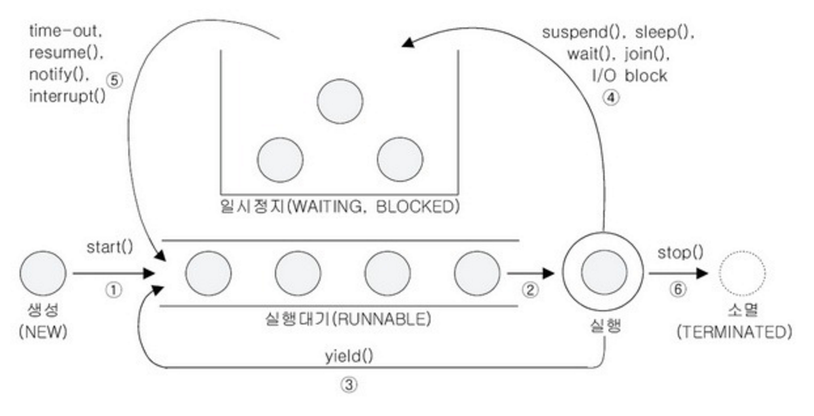

# 쓰레드

## 쓰레드란
- 쓰레드란 간단히 프로그램의 처리 흐름입니다. 실와 비교하면 실 처음 부분에서 실을 따라가다 보면 결국 한방향으로 가게되면서 끝까지 가게 됩니다. 이를 프로그램에 비교하면 여러 함수를 실행해도 결국 한방향으로 순차적으로 맨 끝처리까지 가게되어 종료되는 의미입니다.
- 싱글 쓰레드
    - for문을 반복하거나 if문을 조건 분기하는 등 여러가지 복잡한 처리를 한가지 흐름으로 진행하여 처리하는 프로그램을 싱글 쓰레드 프로그램이라고 합니다.
    - 싱글 쓰레드 프로그램에서는 어떠한 시점에서 실행중인 처리가 오직 한개입니다.
    - Java언어에서는 프로그램을 실행하는 주체로도 쓰입니다.
    - 간단한 싱글 쓰레드 코드
        ~~~ java
        // 메인 쓰레드만 실행되는 싱글 쓰레드 코드
        public class Main {
            public static void main(String[] args) {
                for(int i=0; i<1000; i++) {
                    System.out.print("Good!");
                }
            }
        }
        ~~~
- 멀티 쓰레드
    - 여러개의 쓰레드로 구성된 프로그램을 멀티 쓰레드 프로그램이라고 합니다.
    - 멀티 쓰레드는 동시처리가 필요하거나 처리가 오래걸리는 동작을 하는동안 다른 동작을 하기 위해 쓰입니다.
    - 예를 들면, 검색 버튼을 눌렀을때 검색 중지 버튼와 재검색 버튼이 생기는데 이때 검색 중지 버튼을 누르게 되면 검색을 중지하게 됩니다. 이때 검색 쓰레드와 검색 중지 쓰레드 두개가 동시에 동작하고 있다는걸 알 수 있습니다.
    - 또다른 예로 일반적으로 파일이나 네트워크 I/O처리에는 시간이 걸립니다. 그럼 그 처리시간동안 아무활동을 못하게 되는데, 이때 두개의 쓰레드로 하나의 쓰레드는 입출력 처리를 하고 나머지 하나가 다른 동작을 할 수 있게 만드는 것입니다.
    - 이처럼 멀티 쓰레드 프로그램은 두가지 동작이상을 할 수 있다고 보면 될 것 같습니다.
    - 멀티 쓰레드 코드
        ~~~ java
        // Nice를 출력하는 새로운 쓰레드
        public class MyThread extends Thread {
            @Override
            public void run() {
                for (int i=0; i<1000; i++) {
                    System.out.print("Nice!");
                }
            }
        }

        // Good을 출력하는 메인 쓰레드
        public class main {
            public static void main(String args[]) {
                // 실제 새로운 쓰레드 동작 방법
                MyThread t = new MyThread();
                t.start();
                for(int i=0; i<1000; i++) {
                    System.out.println("Good!");
                }
            }
        }
        ~~~

## 쓰레드의 기동
- Thread.class 상속
    - Thread.class를 상속받아 run() 메소드를 오버라이드하여 로직을 채워넣습니다.
    - 이후 Main Thread(main 함수)에서 상속받은 클래스의 인스턴스를 생성하여 Start() 시킵니다.
    - 코드
    ~~~ java
    // Thread를 상속받은 클래스
    public class PrintThread extends Thread {
        private String message;
        public PrintThread(String message) {
            this.message = message;
        }
        @Override
        public void run() {
            for(int i=0; i<1000; i++) {
                System.out.print(message);
            }
        }
    }

    public class Main {
        // 쓰레드 클래스 인스턴스 두개를 선언하여 두개의 쓰레드를 동작시킵니다.
        public static void main(String args[]) {
            new PrintThread("Good!").start();
            new PrintThread("Nice!").start();
        }
    }
    ~~~
    - 데몬 쓰레드는 setDaemon 메소드를 통해서 데몬 쓰레드를 만들 수 있는데, 특징적인 점은 메인 쓰레드가 종료되면 다른 쓰레드들은 종료되는데 데몬 쓰레드로 지정된 쓰레드는 작업이 다끝나야 종료됩니다.
- Runnable.class 상속
    - Thread 인스턴스를 만들때 Runnable을 상속받은 클래스의 인스턴스나 익명객체를 통한 Runnable 구현와 같은 방법으로 생성자에 구현체를 전달하여 실행시킬 수 있습니다.
    - Thread의 시작은 언제 start로 시작합니다.
    ~~~ java
    // Runable 인터페이스를 상속받아 run() 메소드를 구현한 클래스
    public class Printer implements Runnable {
        private String message;
        public printer(String message) {
            this.message = message;
        }
        @Override
        public void run() {
            for (int i=0; i<1000; i++) {
                System.out.print(message);
            }
        }
    }

    public class Main {
        public static void main(String args[]) {
            // 인스턴스 생성 방식에 따라 Runnable 생성 후 쓰레드에 인자를 넘겨 실행 1
            new Thread(new Printer("Good!")).start();

            // 인스턴스 생성 방식에 따라 Runnable 생성 후 쓰레드에 인자를 넘겨 실행 2
            Runnable r = new Printer("Good2!");
            new Thread(r).start();

            // 익명객체를 통한 Runnable 직접 구현
            new Thread(new Runnable() {
                @Override
                public void run() {
                    for (int i=0; i<1000; i++) {
                        System.out.print("Good3!");
                    }   
                }
            }).start();

        }
    }
    ~~~

## 쓰레드 일시정지
- Thread 클래스의 Sleep() 메소드를 사용하여 쓰레드의 실행을 일시정지 시킬 수 있습니다.
- Main.class에서 실행시 메인 쓰레드의 동작을 일시정지 시킬 수 있습니다.
- 코드
    ~~~ java
    public class Main {
        public static void main(String args[]) {
            for(int i=0; i<1000; i++) {
                System.out.println("Good!");
                try {
                    // 1초동안 메인 쓰레드 일시정지
                    Thread.sleep(1000);
                } catch(InterruptedException e) {
                    // 예외 처리
                }
            }
        }
    }
    ~~~

## 쓰레드의 배타제어
- 하나의 쓰레드가 처리중이면 다른 쓰레드가 접근을 하지못하게 막는 것을 쓰레드의 배타제어 혹은 상호베타라고 합니다.(mutual exculsion)
- 즉, 쓰레드 A와 쓰레드 B가 병행하여 동작하는 경우 쓰레드 A가 함수 처리 도중 쓰레드 B가 난입하여 먼저 데이터를 처리하게 되면 데이터 동기화가 되지 않는 다는지 등 예기치 않는 상황이 발생하게 되는데 이러한 경쟁상태를 데이터 레이스 혹은 레이스 컨디션이라고 부릅니다.
- 이러한 데이터 레이스 상태를 조율하는게 베타제어라고 합니다.
- java에서는 이러한 쓰레드의 베타제어를 synchronized라고 하는 키워드를 사용합니다.
- [synchronized] 메소드
    - 메소드에 해당 키워드를 붙이게 되면 그 메소드는 하나의 쓰레드에서만 동작하게 됩니다.
    - 즉, 한번에 한 개 쓰레드만 해당 함수에 접근하여 동작시킬수 있다는 의미입니다. 이는 다른말로 동기화된 메소드라고도 불립니다.
- [synchronized] 블록
    - synchronized가 걸린 메소드등은 왜 하나의 쓰레드만 접근할 수 있을까?
    - 위의 질문에는 synchronized걸리게 되면 블록(락)이 형성되는데 이때 하나의 쓰레드가 먼저 synchronized가 걸린 메소드에 접근하게 될때 이 락을 취하게 됩니다. 이후 다른 쓰레드가 접근하게 될때 이미 락을 취한 쓰레드가 존재하기 때문에 락을 취하기 전까지는 함수에 접근하지 못하고 대기하게 되는 것입니다.
    - synchronized가 걸린 메소드를 포함하는 클래스를 선언 후 사용하게 될때 블록이 형성되는데, 이를 락이라고 불리며 해당 락은 벽처럼 다른 쓰레드의 접근을 막습니다.
    - 쓰레드가 실행을 끝나고 락을 반납하게 되면 다음 쓰레드가 락에 접근하여 메소드를 실행시킬 수 있습니다.
    - synchronized한 클래스 메소드는 또한 쓰레드 배타제어를 위해 그 클래스의 클래스 객체 락을 사용합니다. 즉, 클래스 메소드에 접근시 클래스에 대한 락을 점유하게 되며 다른 쓰레드가 해당 클래스 다른 synchronized가 걸린 메소드에 접근 할 수 없습니다.
    
## 쓰레드의 협조
- syncronized 메소드를 실행하고 있는 도중에는 다른 쓰레드가 그 메소드를 실행할 수 없습니다. 사용은 할 순없지만 대기하거나 해당 메소드의 락이 비어있게 되었을때 다른 쓰레드에게 알리는 등의 행위를 제어할 수 있습니다.
- [wait set] : 쓰레드 대기실
    - 모든 인스턴스는 wait set을 가집니다.
    - wait 메소드가 실행되면 쓰레드들은 동작을 정지하고 대기 쓰레드 집합이라는 곳으로 들어가게 되는 그곳이 wait set입니다.
    - 쓰레드가 wait 메소드를 실행하면 동작을 일시정지하고 wait set이라는 곳으로 들어갑니다. 그리고 어느 특정 상황이 발생하지 않는 이상 영원히 그곳에서 대기합니다.
        - 특정상황으로는..
        - 다른 쓰레드에서 notify 메소드에 의해 깨어난다.
        - 다른 쓰레드에서 notifyAll 메소드에 의해 깨어난다.
        - 다른 쓰레드에서 interrupt 메소드에 의해 깨어난다.
        - wait 메소드가 타임아웃 된다.
- [wait] 메서드
    - wait 메서드를 실행시키게 되면 동작은 일시정지되고 wait set으로 들어가게 됩니다.
    - wait 메서드를 실행하기 위해서는 쓰레드가 락을 가지고 있어야 합니다. 
    - wait 셋에 들어갈때 쓰레드는 그 인스턴스의 락을 해제하고 들어가게 됩니다.
- [notify] 메서드
    - wait set에 있는 쓰레드 한개를 꺼내옵니다. 즉, 쓰레드 한개를 동작할 수 있게 깨우는 것 입니다.
    - notify도 마찬가지로 메서드를 실행하기 위해서는 쓰레드가 락을 가지고 있어야 합니다.
- [notifyAll] 메서드
    - notifyAll 메서드를 실행하게 되면 wait set에 들어있는 모든 쓰레드들을 깨우고 동작이 가능한 상태로 만듭니다.
    - notify와 차이점은 다깨운다는 점 뿐입니다.

## 쓰레드의 상태 변화
- NEW, RUNNABLE, TERMINATED, WATING, TIMED_WATING, BLOCKED 등이 있습니다.(Enums-Thread.state)
- Thread.class에서 getState()로 얻을 수 있습니다.
- 그림
    
