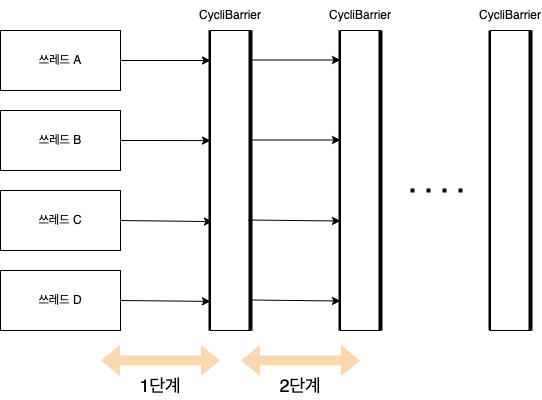

# Two-Phase Termination

## 설명
- Two-Phase(2단계) Termination(종료), 직역하면 2단계 종료이다. 종료 처리를 2단계로 두어 종료를 확실하게 하는 패턴이다.
- 2단계 종료는 (작업 중 -> 종료 요구) 1단계와 (종료 처리 중 -> 종료 처리 완료) 2단계 두단계로 종료 처리를 진행한다.
- 예를 들면) 작업중인 자바 프로세스에 종료 요구를 하게 되면 바로 전체 강제 종료가 아닌 뒷처리 혹은 뒷정리를 시작하게 되며 이때 다른 작업들은 진행이 불가능하며 이후 완료 되면 프로세스가 종료 된다.
    1. 자바 A 프로세스에 종료 요구
    2. 자바 A 프로세스는 그 즉시 종료 처리를 시작한다. 이때, 다른 쓰레드는 진행이 불가능하다.
    3. 자바 A 프로세스에서 진행중이던 쓰레드들이 다 종료 되거나 특정 시그널을 통해 종료 처리가 완료되면 이후 프로세스 종료(메인 쓰레드 종료)

## 내생각
- 스프링 부트 서버를 종료할때 kill -9가 아닌 kill -15를 통한 graceful 종료할때 사용하는 패턴 같다.
- 또한 스프링 부트는 보통 web의 경우 요청처리가 대부분 Thread로 동작(요청처리당 Thread, 비동기 방식이 아닌이상)하는게 많기 때문에 자바내에서 제공 되는 shutdownhook를 통해서 쓰레드 작동을 멈출수 있다.
    - Runtime.getRuntime() <- 요 클래스에 있다. 
    - 스프링 부트 종료 방식 생각
        1. Runtime shutdown hook 등록
        2. 전체 쓰레드(?)를 관장하는 어떤 쓰레드 풀이나 클래스를 통해 쓰레드 동작을 체크.
        3. 이후 전체 종료되어 반환되는지를 확인 되면 이후 종료 프로세스를 진행한다.
        4. 만약 일정 시간내에 종료가 안되고 반환이 안된다면 전체 쓰레드를 interrupted 시킨다.
- 여기서 또 신기한 클래스가 등장했다. 바로 'CyclicBarrier.class' 클래스다. 이게 뭐하는놈이냐 하면 특정 쓰레드들이 동작을 시작하게 되는데 이때 단계별로 실행이 된다고 가정하자.
- 이때 단계별로 실행되는 쓰레드들이 1단계 -> 2단계로 넘어가려면 특정 개수만큼 다처리 되야만 그 이후 단계로 넘어갈수있게 하는 장벽같은 역할을 한다.
    1. A, B, C, D 쓰레드 1단계 동작 시작
    2. A, B, D 쓰레드 동작 완료(1단계 장벽 도달)
    3. 아직 C 쓰레드가 동작이 진행중임으로 나머지는 대기한다.
    4. 이후 C쓰레드까지 동작이 완료(1단계 장벽 도달)되면 A, B, C, D 쓰레드는 다음 2단계 동작을 시작한다.
    
- 단점은.. 병목현상이 생겨 멈처버리거나 예외가 발생한다면? 어떻게 처리해야될까? retry를 시도해야하나 아니면 그냥 넘어가야하나...? 생각보다 구현하는게 복잡할수도 있을것 같다.

## 예제
- 예제는 총 3가지로 설명한다.
    1. Two-Phase 2가지 방식
    2. CycliBarrier 예제

### Two-Phase Termination
1. 일반적인 방식
~~~ java
    public class CountupThread extends Thread {
        private long counter = 0;
        private volatile boolean shutdownRequested = false;

        public void shutdownRequest() {
            shutdownRequested = true;
            interrupt();
        }

        public boolean isShutdownRequested() {
            return shutdownRequested;
        }

        public final void run() {
            try {
                // 가드 조건 -> shutdownRequested
                while(!shutdownRequested) {
                    doWork();
                }
            } catch() {
            } finally {
                doShutdown();
            }
            
        }

        private void doWork() throws InterruptedException {
            // 일련의 작업
        }

        private void doShutdown() {
            // 일련의 작업
        }
    }

    public class Main {
        public static void main(String args[]) {
            try {
                CountupThread t = new CountupThread();
                t.start();

                Thread.sleep(10000); // 테스트를 위해 잠시 시간을 비워둔다
                t.shutdownRequest(); // 쓰레드 종료 요구

                t.join(); // 쓰레드 종료를 기다림
            } catch() {}
        }
    }
~~~

2. shutdownhook 방식
- 처음 보는 함수와 기능이다..
~~~ java
    public class Main {
        public static void main(String args[]) {
            
            // 캐치되지 않는 예외의 핸들러 설정
            Thread.setDefaultUncaughtExceptionHandler(
                new Thread.UncaughtExceptionHandler() {
                    public void uncaughtException(Thread thread, Throwable exception) {
                        // 일련의 작업
                        // Thread 이름과 예외 에러를 출력하여 캐치되지 않는 예외를 확인 한다.
                    }
                }
            )

            // 셧다운 후크 설정
            Runtime.getRuntime().addShutdownHook(
                new Thread() {
                    public void run() {
                        // 종료전 처리 작업 진행(뒷작업)
                    }
                }
            )

            // 셧다운 후크 설정 후 다른 쓰레드 실행
            // 작업이 진행되지 않는다.
            new Thread("Test") {
                public void run() {
                    // 일련의 작업 아무거나..
                }
            }.start();
        }

    }
~~~

### CyclicBarrier
~~~ java
    public class Main {
        private static final int THREAD_COUNT = 3;

        public static void main(String args[]) {
            ExecutorService service = Executors.newFixedThreadPool(THREAD_COUNT);

            Runnable barrierAction = new Runnable() {
                public void run() {
                    // 배리어에 전체 쓰레드가 도달했을시 이후 작업
                    // 이 작업이 처리된후에 그 다음 단계가 실행된다.
                }
            }

            CyclicBarrier phaseBarrier = new CyclicBarrier(THREAD_COUNT, barrierAction);
            CountDownLatch doneLatch = new CountDownLatch(THREAD_COUNT);

            try {
                for(int t=0;t<THREAD_COUNT;t++) {
                    // countdownlatch는 일의 종료를 조사하는 역할, THREAD_COUNT만큼 쓰레드가 종료됬는지 체크 
                    // 이후 다 종료되면 phaseBarrier 실행
                    service.execute(new MyTask(phaseBarrier, doneLatch, t));
                }
                doneLatch.await();
            } catch(){}
            finally {
                service.shutdown();
            }
        }
    }

    public class MyTaskl implements Runnable {
        private static final int PHASE = 5;
        private final CycliBarrier phaseBarrier;
        private final CountDownLatch doneLatch;
        private final int context;
        private static final Randmom random = new Random(314159);

        public MyTask(CycliBarrier phaseBarrier, CountDownLatch doneLatch, int context) {
            this.phaseBarrier = phaseBarrier;
            this.doneLatch = doneLatch;
            this.context = context;
        }

        public void run() {
            try {
                for(int phase=0;phase<PHASE; phase++) {
                    doPhase(phase);
                    phaseBarrier.await();
                }
            } catch() {
                finally {
                    doneLatch.countDown();
                }
            }
        }

        protected void doPhase(int phase) {
            try {
                // 일련의 작업
            } catch() {}
        }
    }
~~~